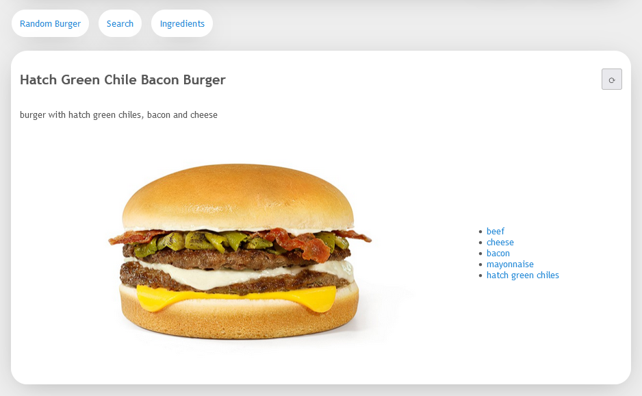

# Burgers API

### API Methods

* Search Burger by name
* List all Burgers by first letter
* Search ingredient by name
* Lookup full Burger details by id
* Lookup Ingredient by ID
* Lookup a random Burger
* Search by ingredient
* Creating a new Burger.

Refer to http://{host}/swagger/index.html for details.

### Demo SPA in React.js



### ERD


### Auto-Migrate

Build and Run on Windows x64

```shell
go build -o ./../bin/cli/migrate.exe cmd/migrate/migrate.go
```

```shell
cd ./../bin/cli; if ($?) { ./migrate.exe }
```

Build and Run on Linux

```shell
env GOOS=linux GOARCH=amd64 && go build -o ./../bin/cli/migrate cmd/migrate/migrate.go
```

```shell
cd ./../bin/cli && ./migrate
```

### Steps to build and run the Back-End

Build and Run on Windows x64

```shell
go build -o ./../bin/cli/burgers-api.exe cmd/main/main.go
```

```shell
cd ./../bin/cli; if ($?) { ./burgers-api.exe }
```

Build and Run on Linux

```shell
env GOOS=linux GOARCH=amd64 && go build -o ./../bin/cli/burgers-api cmd/main/main.go
```

```shell
cd ./../bin/cli && ./burgers-api
```

Stop the app with ^C.

### Dockerized app

Stop the App

```shell
docker-compose -f ./docker-compose.yml down
```

Build the Image

```shell
 docker-compose -f ./docker-compose.yml build
```

Run the App

```shell
docker-compose -f ./docker-compose.yml up -d
```

### Generate Open API Docs

Windows:

```shell
swag init -g cmd/main/main.go --parseInternal --parseDependency --parseDepth 1  && swag fmt -g cmd/main/main.go
```

Linux:

```shell
~/go/bin/swag init -g cmd/main/main.go --parseInternal --parseDependency --parseDepth 1  && \ 
~/go/bin/swag fmt -g cmd/main/main.go 
```

### HTTP Testing

```

### Search Burgers by Name

GET http://localhost:8080/api/burgers/search?name=2

### Search Burgers by ingredient Name

GET http://localhost:8080/api/burgers/search/ingredient?name=creo

### List All starting Letters of Burger Names

GET http://localhost:8080/api/burgers/search/first-letters

### List all Burgers by first letter

GET http://localhost:8080/api/burgers/search/first-letter?letter=t

### Lookup full BURGER details by id

GET http://localhost:8080/api/burgers/1

### Lookup a random Burger

GET http://localhost:8080/api/burgers/random

### Create Burger

POST http://localhost:8080/api/burgers
Content-Type: application/json

{
  "name": "Test Burger 1",
  "description": "Tasty Test Burger 1.",
  "image_url": null,
  "ingredients": [
    {
      "id": 7,
      "name": "lettuce"
    },
    {
      "id": 15,
      "name": "pickles"
    },
    {
      "id": 18,
      "name": "tomato"
    }
  ]
}
```

```
### Search ingredient by Name

GET http://localhost:8080/api/ingredients/search?name=beef

### Lookup full ingredient details by id

GET http://localhost:8080/api/ingredients/1
```

```
# curl -X POST http://localhost:8080/upload
#  -F "file=@/Users/appleboy/test.zip"
#  -H "Content-Type: multipart/form-data"

POST http://localhost:8080/api/images
Content-Type: multipart/form-data; boundary=WebAppBoundary

--WebAppBoundary
Content-Disposition: form-data; name="file"; filename="Tribute.jpg"

< D:\burgers\Tribute.jpg
--WebAppBoundary--
```

### Steps to build the Front-End

```shell
cd ./front-end/
```

```shell
npm install
```

for Development:

```shell
npm run dev
```
for Production:

```shell
npm run prod
```
